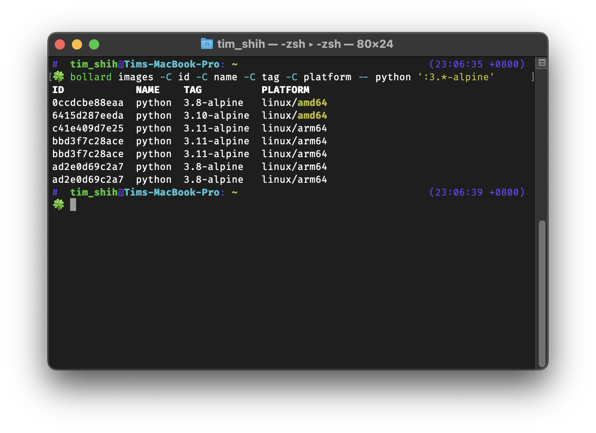

# Bollard

Drop-in docker command wrapper that silently provide more handful options and alias.



> I'm tired of piping docker output to docker command for complex operation.
> So have this tool to do the query for me.

## Usage

This tool is in early stage, please install it from source:

```bash
pip install git+https://github.com/tzing/bollard.git
alias docker=bollard
```

Bollard preserves all docker's options in wrapped commands.
For the rest of commands, arguments are passed to docker without any modification.

The only wrapped command:

- `docker image ls`
